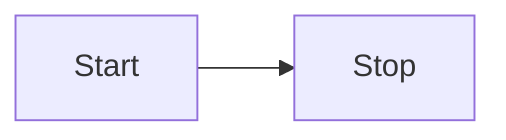

## Recommendation

1. Reduce the server size of nodes like Zookeeper, Schema registry, Control Centre, rest proxy.
2. Ask customers to spin up their own KSQL DB instance, instead we managing it. But customer have to get the licence.
3. Upgrade infra to 7.6.1 and 2.8.1 (ARM processors)
4. Increase the payload size to 8 MB
5. Run Control centre in management  mode, as all metrics will be in Datadog.
6. Run ingress controller as Daemon set. This will reduce cost and have HA.
7. Plan to remove rest proxy based on use cases
8. Have proper naming convention for Datadog dashboard.
9. Tiered storage for topics
10. Automate cert generation process or increase the expiry date to like 2 years till stockholm platform is decommission. 
11. Automate root ca distribution 
12. Try and bill me battery completely for the cluster they are using.
13. Automate root CA distribution 
14. Reduce 3 connect node to just 2
15. Charge customer additionally for dedicated cluster.
16. For Batch processing application. retain offset and topic data 1 day more that month.
17. Best practise, add customer ID in producer and consumer app.
18. Create Run book different possible scenario
19. Confluent have some support bundle, which will collect all possible logs which they would need.
20. If customer onboards, he has to sign for certain period, if they leave before that, we should have a penalty

### Throttling:
CPU average 60%, N/W threads = number of cores, Request queues = number of queues
Disk usage average 60%

## Week 2

1. Calculate what is the benchmark for Kafka as a platform.
2. Enable rack awareness in Kafka yaml file
3. Create a run book for every scenario for all possible scenario.


Broker replication ISR(in-sync replicas) and observer

1> when configuring a cluster, we have 6 broker and 3 zookpeer


Note:



flowchart LR
Start --> Stop
```


To Read:
[https://support.confluent.io/hc/en-us/articles/360041929932-How-to-set-Quotas-in-Kafka#network-bandwidth-and-request-quotas-(per-broker)](https://support.confluent.io/hc/en-us/articles/360041929932-How-to-set-Quotas-in-Kafka#network-bandwidth-and-request-quotas-(per-broker) "https://support.confluent.io/hc/en-us/articles/360041929932-how-to-set-quotas-in-kafka#network-bandwidth-and-request-quotas-(per-broker)")

[https://support.confluent.io/hc/en-us/articles/360001447266-Kafka-Broker-Performance-Diagnostics-2-0](https://support.confluent.io/hc/en-us/articles/360001447266-Kafka-Broker-Performance-Diagnostics-2-0 "https://support.confluent.io/hc/en-us/articles/360001447266-kafka-broker-performance-diagnostics-2-0")

[https://docs.confluent.io/cloud/current/access-management/authenticate/oauth/identity-pools.html](https://docs.confluent.io/cloud/current/access-management/authenticate/oauth/identity-pools.html "https://docs.confluent.io/cloud/current/access-management/authenticate/oauth/identity-pools.html")


[https://docs.confluent.io/cloud/current/access-management/authenticate/oauth/identity-pools.html#supported-common-expression-language-cel-filters](https://docs.confluent.io/cloud/current/access-management/authenticate/oauth/identity-pools.html#supported-common-expression-language-cel-filters "https://docs.confluent.io/cloud/current/access-management/authenticate/oauth/identity-pools.html#supported-common-expression-language-cel-filters")


[https://docs.confluent.io/operator/current/co-deploy-cfk.html#enable-webhooks](https://docs.confluent.io/operator/current/co-deploy-cfk.html#enable-webhooks "https://docs.confluent.io/operator/current/co-deploy-cfk.html#enable-webhooks")
[https://docs.confluent.io/operator/current/co-roll-cluster.html](https://docs.confluent.io/operator/current/co-roll-cluster.html "https://docs.confluent.io/operator/current/co-roll-cluster.html")


https://docs.confluent.io/platform/current/multi-dc-deployments/multi-region.html
![[Pasted image 20240125114911.png]]


https://github.com/rohits-dev/dev-lab-aws/blob/main/cluster-resources/samples/confluent/perf-deployment.yaml


[https://aws.amazon.com/blogs/networking-and-content-delivery/building-a-global-network-using-aws-transit-gateway-inter-region-peering/](https://aws.amazon.com/blogs/networking-and-content-delivery/building-a-global-network-using-aws-transit-gateway-inter-region-peering/ "https://aws.amazon.com/blogs/networking-and-content-delivery/building-a-global-network-using-aws-transit-gateway-inter-region-peering/")


CFK upgrade
CP service to latest version
Then move to new node pool one by one


clean up script
https://support.confluent.io/hc/en-us/articles/360052477932-How-to-delete-unused-Confluent-Control-Center-internal-topics


local cli script then connet to CP

https://docs.confluent.io/platform/current/security/rbac/rbac-cli-quickstart.html#sign-in-to-cluster

check if rbacs exists
https://docs.confluent.io/confluent-cli/current/command-reference/iam/rbac/role-binding/index.html#confluent-iam-rbac-role-binding

rest api to cehck rbacs
https://docs.confluent.io/platform/current/security/rbac/mds-api.html#rbac-rolebinding-crud


Load testing / performance testing

Comparison with the old throughputs message size being 100 Kb

No. of Records Throughput Avg. Latency Max. Latency

Old Test 10000 records sent 256.154102 records/sec (48.86 MB/sec) 607.88 ms avg latency 1477.00 ms max latency

New Test 10000 records sent 915.667063 records/sec (87.32 MB/sec) 324.42 ms avg latency 1009.00 ms max latency

Still better performance are observed when we use compression types. For this, 10K messages of 100 KB size were produced by a single producer. Shown below is the comparison between various compression formats.

Compression Type Throughput Avg. Latency in ms Max. Latency in ms

None 915.667063 records/sec (87.32 MB/sec) 324.42 ms avg latency 1009.00 ms max latency

Lz4 1125.239113 records/sec (107.31 MB/sec) 237.42 ms avg latency 987.00 ms max latency

Gzip 257.599176 records/sec (24.57 MB/sec) 17.33 ms avg latency 851.00 ms max latency

snappy 1148.897059 records/sec (109.57 MB/sec) 254.36 ms avg latency 979.00 ms max latency

Summary of Performance Testing – Message
